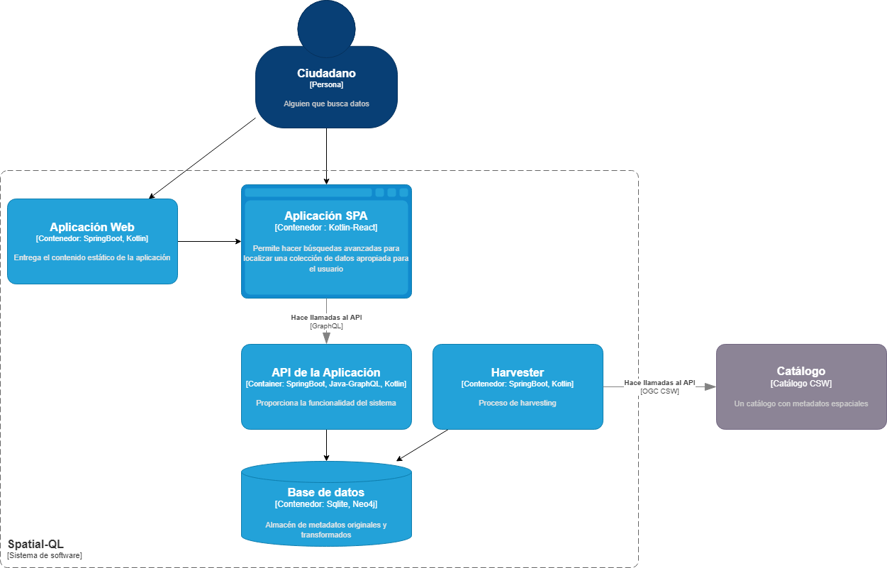
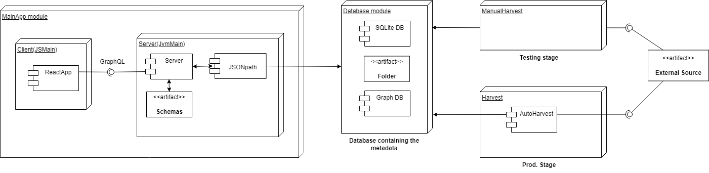
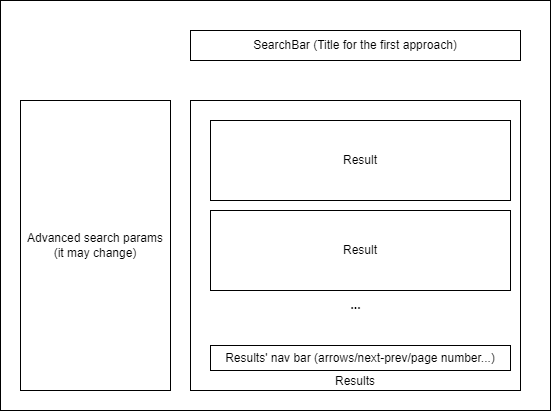
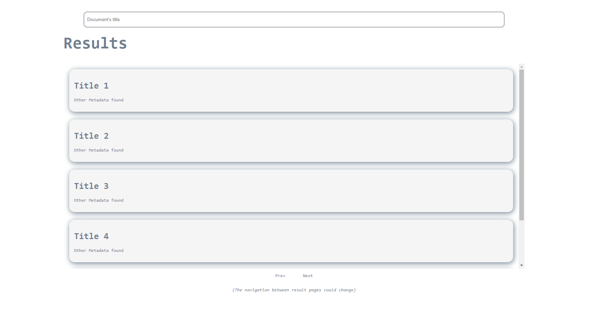

# space-ql
TFG Alejandro Magallón

## Diagrams
### High concept diagram

This diagram is a very high level specification of each piece of the system, so it
is easy to explain to people that doesn't know much about technology.

### Deployment diagram

This diagram shows the deployment scheme of the application. There are three main modules:

The Client: A KotlinJS app that serves a React web application.

The server: A Spring-Kotlin app that acts as an API and serves the database information to the client. The
client uses GraphQL to make the requests to the server.

The database: In a first approach the database will be a folder with different XML files containing 
some metadata. Later it is supposed to be a graph-oriented database. In the project's final state, the 
document retrieval process can be automated in a "Harvest" app, that may access the data source and store 
the data in the database.

### Client's design

This diagram shows a first approach to the client's design. It is supposed to 
be a title-based search, so it wouldn't take any other parameter. On future releases
it must let the user search for any possible metadata and filter the different results.

This is the first design for the client. It's a very simple design with an input, and some result cards.
That cards show the title and any extra metadata chosen. It is thought to be implemented with react and 
ElasticSearch.
